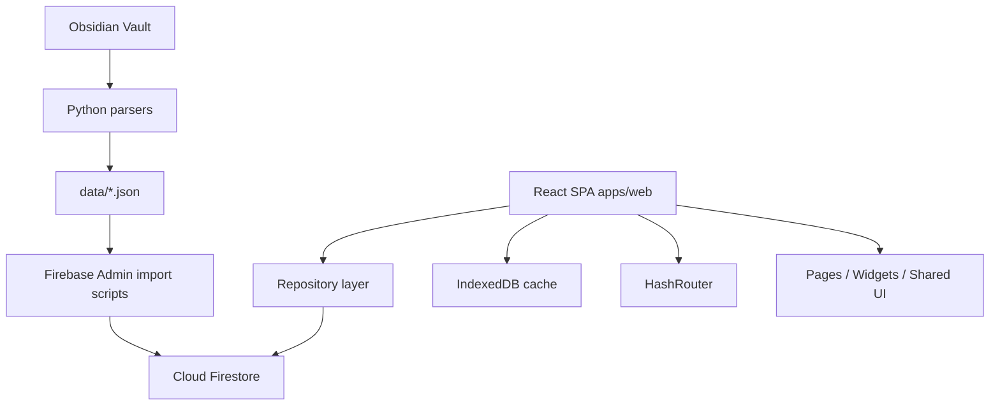

# E'Magios Core — Официальный сайт

Официальный веб-сайт настольной ролевой системы **E'Magios Core**.

**Live Site:** [https://kaliguri.github.io/E-Magios-Core-Site/](https://kaliguri.github.io/E-Magios-Core-Site/)

## О проекте

E'Magios Core — это настольная ролевая система о магах, которые создают собственные заклинания и исследуют мир магии. Сайт объединяет справочные книги, базу данных правил, новости, профиль пользователя и редактор персонажей.

Проект развивается как гибридная платформа:

- **Legacy HTML/CSS/JS** остаётся как опубликованный статический сайт и источник совместимости для GitHub Pages.
- **React + TypeScript + Vite** в `apps/web` реализует новый интерфейс приложения с маршрутизацией, сайдбаром, базой данных и редактором персонажей.
- **Firebase Authentication** используется для входа через Google.
- **Cloud Firestore** хранит публичный справочник, новости, профили и персонажей пользователей.
- **JSON-файлы** используются как промежуточный формат импорта из Obsidian Vault в Firestore.
- **IndexedDB cache** ускоряет загрузку справочника и хранит последнюю успешно загруженную версию данных.

## Основные возможности

- **Книги правил**: PHB, Spellbook, Master's Handbook, Craftbook и Compendium of Rumors.
- **Новости**: лента обновлений проекта.
- **База данных**: вкладки справочника, фильтры, поиск, сортировка, детальные модальные окна и переходы между связанными объектами.
- **Редактор персонажей**: расчёт характеристик, навыки, школы, заклинания, экспорт JSON и облачное сохранение.
- **Профиль**: данные пользователя, настройки отображаемого имени и интеграции.
- **Защита закрытого контента**: пароль `147` для защищённых книг, состояние доступа хранится в `localStorage`.

## Технологии

- **React 18** — компонентный UI.
- **TypeScript** — типизация доменной модели, репозиториев, хуков и UI-компонентов.
- **Vite** — dev server и production build нового SPA.
- **React Router v6** — hash-based routing для совместимости с GitHub Pages.
- **Firebase Web SDK v10** — Authentication и Firestore.
- **Firebase Admin SDK** — import scripts для загрузки JSON-данных в Firestore.
- **idb / IndexedDB** — клиентский кеш справочника.
- **CSS Modules** — локальные стили React-компонентов.
- **Legacy HTML/CSS/JS** — существующие страницы и контент книг.
- **Python scripts** — парсинг Markdown из Obsidian Vault и генерация JSON/HTML.

## Архитектура



### Слои React-приложения

- `src/app` — точка входа приложения, роутинг и глобальные стили.
- `src/pages` — страницы верхнего уровня: главная, новости, профиль, база данных, редактор персонажей, книги.
- `src/widgets` — крупные UI-блоки: layout, sidebar, таблица базы данных, детальное окно.
- `src/features` — пользовательские сценарии и состояние: фильтры БД, сортировка, modal history, auth/state редактора персонажа.
- `src/entities` — доменные типы, DTO, схемы и мапперы для `compendium`, `content`, `character`.
- `src/shared` — Firebase client, repositories, cache, UI primitives, общая конфигурация.

### Repository pattern

Доступ к данным вынесен в репозитории:

- `CompendiumRepository` — читает опубликованный справочник из Firestore.
- `ContentRepository` — читает новости и manifest версий контента.
- `CharacterRepository` — сохраняет и загружает персонажей из `users/{uid}/characters/{id}`.

UI не обращается к Firebase SDK напрямую. Это снижает связность кода и упрощает поддержку доступа к данным.

### Cache-aside pattern

`useCompendiumData` сначала отдаёт данные из IndexedDB, затем сверяет версию с `contentManifest/production` и при необходимости обновляет кеш. Такой подход уменьшает количество сетевых запросов и ускоряет повторные открытия базы данных.

### Конфигурационная модель БД

Вкладки базы данных описаны декларативно через `COMPENDIUM_CONFIGS`: ключ сущности, название, Firestore collection, manifest key, schema columns/filters и fetcher. Благодаря этому новые разделы справочника добавляются через конфигурацию, а не через копирование логики таблиц.

## Исходные материалы

Контент для сайта берётся из приватного репозитория Obsidian Vault:
- **Исходный репозиторий:** [Obsidian-Vault](https://github.com/Kaliguri/Obsidian-Vault) *(приватный)*
- 📁 **Локальный путь:** `C:\Users\Kaliguri\Documents\Obsidian Vault\E'Magios Core\`
- 📋 **Требования к оформлению:** `E'Magios Core/099. Требования к оформлению.md`

### Автоматизация: Python скрипты парсинга

JSON данные генерируются автоматически из Markdown файлов Obsidian:

```bash
# Парсинг школ магии (38 школ)
python parse_schools.py

# Парсинг заклинаний (103 заклинания)
python parse_spells.py

# Парсинг эффектов (17 эффектов)
python parse_effects.py

# Парсинг архетипов (13 архетипов)
python parse_archetypes.py

# Парсинг базовых и отдыховых действий (19 действий)
python parse_actions.py

# Парсинг навыков личности и магии (10 навыков)
python parse_skills.py

# Парсинг типов действий (12 типов)
python parse_action_types.py

# Парсинг компонентов боевой системы (18 компонентов)
python parse_combat_components.py
```

**Подробнее:** См. `PARSING_SCRIPTS.md` для полной документации по скриптам

**Что парсят скрипты:**
- Извлекают параметры, описания, принципы, особенности
- Конвертируют wikilinks из Obsidian в связи между объектами
- Генерируют корректные JSON файлы в `data/`:
  - `spells.json`, `schools.json`, `effects.json`
  - `archetypes.json`, `actions.json`, `skills.json`
  - `action_types.json`, `combat_components.json`

**Важно:** Не редактируйте JSON файлы вручную! Используйте скрипты парсинга.

## Структура проекта

```
E-Magios-Core-Site/
├── apps/
│   └── web/                         # React + TypeScript + Vite SPA
│       ├── src/
│       │   ├── app/                 # App, routing, global styles
│       │   ├── pages/               # Page-level screens
│       │   ├── widgets/             # Large UI blocks
│       │   ├── features/            # User scenarios and stateful hooks
│       │   ├── entities/            # Domain types, DTOs, schemas, mappers
│       │   └── shared/              # Firebase, repositories, cache, UI primitives
│       ├── package.json
│       └── vite.config.ts
├── dist-react/                      # Production build of the React app
├── scripts/
│   └── import-content/              # Firestore import scripts
├── data/
│   ├── spells.json
│   ├── schools.json
│   ├── effects.json
│   └── ...
├── phb/ spellbook/ master/ craftbook/ rumors/  # Legacy HTML chapters
├── firestore.rules
├── firestore.indexes.json
├── PARSING_SCRIPTS.md
├── CONTENT_SOURCE.md
└── README.md
```

## Локальная разработка

### React-приложение

```bash
cd apps/web
npm install
npm run dev
```

Production build:

```bash
cd apps/web
npm run build
```

Сборка пишется в `dist-react/`, чтобы не перетирать legacy root.

### Legacy-сайт

```bash
cd C:\Gamedev\E-Magios-Core-Site
python -m http.server 8000
```

Legacy-страницы нужно открывать через `http://localhost:8000`, а не через `file://`, потому что браузер иначе блокирует часть запросов к локальным данным.

### Firestore import

```bash
cd scripts/import-content
npm install
npm run import:compendium
npm run import:news
```

Для импорта нужен `service-account.json` в `scripts/import-content/`. Этот файл нельзя коммитить.

## Развёртывание

React app рассчитан на GitHub Pages:

- `HashRouter` не требует отдельного server rewrite/404 handling.
- `vite.config.ts` использует `base: '/E-Magios-Core-Site/'`.
- `dist-react/` можно публиковать отдельно или объединять с legacy HTML при deploy workflow.

Legacy-часть по-прежнему может публиковаться как статический сайт из корня репозитория.

## Работа с данными

### Content pipeline

1. Исходный контент редактируется в Obsidian Vault.
2. Python-скрипты парсят Markdown и генерируют JSON/HTML.
3. Import scripts загружают JSON в Firestore.
4. Firestore становится единственным runtime-источником опубликованных данных.
5. `contentManifest/production` сообщает клиенту версии коллекций для кеширования.

### Firestore collections

- `spells`, `schools`, `effects`, `actions`, `skills`, `archetypes`, `basics`, `action_types`, `combat_components`, `craft_components`, `craft_professions`, `craft_specializations`, `recipe_types`, `recipes` — публичный справочник.
- `news` — публичные новости.
- `contentManifest/production` — версии опубликованного контента.
- `users/{uid}` — профиль пользователя.
- `users/{uid}/characters/{characterId}` — персонажи пользователя.

Firestore является единственным источником истины в runtime. Если Firebase недоступен, приложение показывает ошибку загрузки или ранее закешированную IndexedDB-версию, но не переключается на статический JSON snapshot.

### Security model

- Публичный справочник доступен только на чтение и только для документов со `status: "published"`.
- Клиент не может писать в справочные коллекции и новости.
- Пользователь может читать и изменять только свой профиль и своих персонажей.
- `auditLogs` закрыты для клиентского чтения и записи.

## Используемые паттерны

- **Component-Based Architecture** — интерфейс разбит на независимые React-компоненты.
- **Feature-Sliced Organization** — код разделён по уровням `app/pages/widgets/features/entities/shared`.
- **Repository Pattern** — доступ к Firestore спрятан за репозиториями.
- **DTO Mapper Pattern** — данные Firestore/JSON преобразуются в доменные модели.
- **Cache-Aside** — приложение сначала читает IndexedDB, затем обновляет данные из Firestore.
- **Configuration-Driven UI** — таблицы, фильтры и вкладки базы данных строятся из схем и конфигураций.
- **Custom Hooks** — состояние сценариев вынесено в `useCompendiumData`, `useCompendiumFilters`, `useDetailModal`, `useCharacterState`, `useCharacterAuth`.
- **Progressive Migration** — legacy HTML не удалён, React-часть развивается параллельно и может постепенно заменять старые страницы.

## Инструментальные средства

- **Cursor IDE** — разработка, рефакторинг, анализ кода и сопровождение миграции.
- **Git** — контроль версий и история изменений.
- **npm** — управление зависимостями React-приложения и import scripts.
- **Vite** — быстрый dev server и production build.
- **TypeScript compiler** — статическая проверка типов.
- **Firebase Console / Firestore / Authentication** — backend-as-a-service.
- **Firebase Security Rules** — разграничение доступа на уровне базы данных.
- **Firebase Admin SDK** — безопасный server-side импорт справочников.
- **Python** — генерация контента из Markdown/Obsidian.
- **Browser DevTools** — проверка UI, сети, консоли и IndexedDB.

## Материалы для защиты диплома

### Что можно сказать об архитектурном решении

Проект построен как клиентская веб-платформа для справочной системы и пользовательского редактора персонажей. Архитектура разделяет представление, бизнес-сценарии и доступ к данным: React-компоненты отвечают за интерфейс, custom hooks управляют состоянием, repository layer изолирует Firebase SDK, а доменный слой описывает типы сущностей.

Такой подход уменьшает связность кода. Например, страница базы данных не обращается к Firestore напрямую: она использует repository layer и получает уже подготовленные доменные данные. Это упрощает развитие системы и позволяет централизованно управлять загрузкой, кешем и ошибками.

### Почему выбран Firebase

Firebase подходит для дипломного проекта, потому что закрывает типовые backend-задачи без отдельного сервера: авторизацию через Google, хранение документов, правила безопасности и масштабируемое чтение публичного справочника. При этом критичные ограничения доступа описаны декларативно в `firestore.rules`.

### Почему JSON не используется как runtime fallback

JSON-файлы не являются вторым источником истины. Они нужны для генерации и импорта контента, а опубликованные данные во время работы приложения читаются из Firestore. Это исключает рассинхронизацию, при которой часть пользователей видит новые данные из Firestore, а часть — устаревший статический snapshot.

### Что демонстрирует проект

- Проектирование SPA на React и TypeScript.
- Интеграцию frontend-приложения с Firebase Auth и Firestore.
- Разработку security rules для разграничения доступа.
- Кеширование данных на клиенте через IndexedDB.
- Импорт и нормализацию контента из внешнего источника.
- Постепенную миграцию legacy-сайта на современную архитектуру без остановки существующего сайта.

## Технические ограничения и дальнейшее развитие

- Добавить runtime validation для данных Firestore/JSON.
- Усилить Firestore rules для схемы персонажей и лимитов размера.
- Исправить стратегию версионирования `contentManifest`, чтобы кеш всегда инвалидировался после импорта.
- Добавить lazy loading страниц для уменьшения размера production bundle.
- Покрыть ключевые хуки и репозитории unit-тестами.
- Настроить GitHub Actions workflow для объединённого deploy React + legacy сайта.


## Лицензия

Контент системы E'Magios Core защищён авторским правом.

Код сайта распространяется под лицензией MIT.

## Контакты

- **GitHub Issues:** [Создать issue](https://github.com/Kaliguri/E-Magios-Core-Site/issues)
- **Основной репозиторий:** [Obsidian Vault](https://github.com/Kaliguri/Obsidian-Vault) *(приватный)*

---

**E'Magios Core** — система о магах, создающих свои уникальные заклинания.
