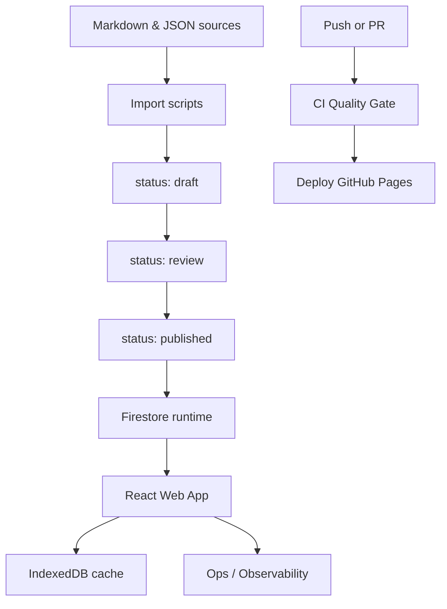

<!-- ============================================================
     README.md — single file, two languages.
     English block first (canonical), Русский below, anchor switcher.
     Left-aligned. No AI mentions.
     ============================================================ -->

<a id="top"></a>

<p>
  <a href="#english"><b>English</b></a>
  &nbsp;·&nbsp;
  <a href="#русский"><b>Русский</b></a>
</p>

# E'Magios Core — Companion Site

> Companion web app for the original **E'Magios Core** tabletop RPG: character editor, world compendium, and a global dice-roller widget. A diploma project built on React + Feature-Sliced Design.

<p>
  <a href="https://github.com/Kaliguri/E-Magios-Core-Site/actions"></a>
  <a href="https://kaliguri.github.io/E-Magios-Core-Site/"></a>
  
</p>

|                      |                                                                                                                                                                                                                                                                                                                                                                                                                                                                                                                                                                                                                                                                            |
| -------------------- | -------------------------------------------------------------------------------------------------------------------------------------------------------------------------------------------------------------------------------------------------------------------------------------------------------------------------------------------------------------------------------------------------------------------------------------------------------------------------------------------------------------------------------------------------------------------------------------------------------------------------------------------------------------------------- |
| **Frontend**         | <a href="https://react.dev/"></a> <a href="https://www.typescriptlang.org/"></a> <a href="https://vitejs.dev/"></a> <a href="https://reactrouter.com/"></a> |
| **Backend & data**   | <a href="https://firebase.google.com/docs/auth"></a> <a href="https://firebase.google.com/docs/firestore"></a> <a href="https://github.com/jakearchibald/idb"></a>                                                                                                                                     |
| **Hosting**          | <a href="https://pages.github.com/"></a> <a href="https://github.com/features/actions"></a>                                                                                                                                                                                                |
| **Content pipeline** | <a href="https://github.com/privatenumber/tsx"></a> <a href="https://www.python.org/"></a>                                                                                                                                                                                                                                                                             |
| **Tooling**          | <a href="https://eslint.org/"></a> <a href="https://prettier.io/"></a> <a href="https://vitest.dev/"></a>                                                                                                                                                                                          |
| **Architecture**     |                                                                                                                                                                                                                                                                                                                                       |

<p>
  <a href="https://kaliguri.github.io/E-Magios-Core-Site/"><b>▶ Open the site</b></a>
</p>

---

<details>
<summary><b>Screenshots</b></summary>

<br>

<details>
<summary>Character editor</summary>


</details>

<details>
<summary>Compendium & dice widget</summary>


</details>

<details>
<summary>News</summary>


</details>

<details>
<summary>Profile & Discord integration</summary>


</details>

</details>

---

## English

<a href="#top"><b>[↑ Back to top]</b></a>

**E'Magios Core is an original tabletop RPG.** This repository is its digital layer: a player-facing web app built on React + Feature-Sliced Design, paired with an engineering pipeline for publishing world content. It was built as a final qualification (diploma) project.

> **What this project demonstrates:** Feature-Sliced Design at real scale, a content-as-data pipeline with audit and versioning, a role-based access model on top of Firestore, an offline cache in IndexedDB, and a zero-cost deploy guarded by a CI quality gate.

### Key features

| Feature               | Description                                                                        |
| --------------------- | ---------------------------------------------------------------------------------- |
| **Character editor**  | Full-featured character sheet with calculations, equipment, and skills             |
| **Compendium**        | World database: spells, creatures, items, schools of magic — with cross-references |
| **Dice roller**       | Global dice widget with roll history and settings                                  |
| **Content workflow**  | Status-based publication model with audit and versioning                           |
| **Observability MVP** | Free telemetry loop: page views, UI errors, load metrics, an `/ops` page           |
| **Role-based access** | `author / editor / admin` on top of Firestore Security Rules                       |

---

## Русский

<a href="#top"><b>[↑ Наверх]</b></a>

> Веб-приложение авторской настольной ролевой системы **E'Magios Core**: редактор персонажа, компендиум мира и глобальный виджет бросков кубов. Дипломный проект на React + Feature-Sliced Design.

**E'Magios Core** — авторская настольная ролевая система. Этот репозиторий — её цифровой контур: веб-приложение игрока на React + Feature-Sliced Design и инженерный конвейер публикации контента. Выполнен как выпускная квалификационная работа.

> **Что демонстрирует проект:** Feature-Sliced Design в боевом масштабе, конвейер «контент как данные» с аудитом и версионированием, ролевую модель доступа поверх Firestore, офлайн-кэш в IndexedDB и zero-cost деплой под защитой CI quality gate.

### Ключевые возможности

| Возможность             | Описание                                                                                 |
| ----------------------- | ---------------------------------------------------------------------------------------- |
| **Редактор персонажа**  | Полнофункциональный лист персонажа с расчётами, экипировкой и навыками                   |
| **Компендиум**          | База данных мира: заклинания, существа, предметы, школы магии — с перекрёстными ссылками |
| **Броски кубов**        | Глобальный виджет дайсов с историей бросков и настройками                                |
| **Контентный workflow** | Статусная модель публикации с аудитом и версионированием                                 |
| **Observability MVP**   | Бесплатный контур телеметрии: page views, ошибки UI, метрики загрузок, страница `/ops`   |
| **Ролевой доступ**      | `author / editor / admin` поверх Firestore Security Rules                                |

---

<details id="for-developers">
<summary><b>For developers</b></summary>

<br>

### Architecture



The project is structured as a hybrid of three layers:

- **Content pipeline** (`scripts/data-pipeline`, `scripts/import-content`) — normalization and validation of sources, a `draft → review → published → archived` status workflow, content versioning, and a publication audit.
- **Serverless backend** — Firebase Auth + Firestore with a role-based access model in `firestore.rules`; the app reads published documents only.
- **Web app** (`apps/web`) — React + TypeScript + Vite on a Feature-Sliced Design architecture, with an offline cache in IndexedDB and its own observability loop.

### Tech stack

|                      |                                                 |
| -------------------- | ----------------------------------------------- |
| **Frontend**         | React 18, TypeScript 5, Vite 5, React Router 6  |
| **Architecture**     | Feature-Sliced Design                           |
| **Backend**          | Firebase Auth + Cloud Firestore                 |
| **Cache / offline**  | IndexedDB (via `idb`)                           |
| **Content pipeline** | TypeScript (`tsx`) + Python                     |
| **Quality**          | ESLint 9, Prettier 3, Vitest 2, Testing Library |
| **CI/CD**            | GitHub Actions + GitHub Pages                   |

### Repository layout

```text
E-Magios-Core-Site/
├── apps/web/                    # React + TypeScript + Vite (Feature-Sliced Design)
├── scripts/import-content/      # Firestore import + workflow + smoke checks
├── scripts/data-pipeline/       # normalize / validate / relations / report
├── data/                        # source JSON for import
├── reports/                     # generated validation and data reports
├── docs/                        # project documentation and UX audit
├── .github/workflows/           # CI and deploy
├── firestore.rules              # role-based access model
└── firestore.indexes.json       # Firestore indexes
```

### Local development

**Web app:**

```bash
cd apps/web
npm install
npm run dev
```

**Import scripts:**

```bash
cd scripts/import-content
npm install
npm run check
```

**Data processing:**

```bash
python scripts/data-pipeline/process_data.py --no-fail-on-errors
```

> Importing into Firestore requires `scripts/import-content/service-account.json`.

### Quality gate

`apps/web`:

```bash
npm run lint
npm run format:check
npm run typecheck
npm run test
npm run check    # aggregator
```

`scripts/import-content`:

```bash
npm run typecheck
npm run smoke
npm run check    # aggregator
```

### CI/CD

| Workflow                       | Trigger                              | Purpose                                                                                                                           |
| ------------------------------ | ------------------------------------ | --------------------------------------------------------------------------------------------------------------------------------- |
| `.github/workflows/ci.yml`     | `pull_request`, `push` to `main/dev` | Install dependencies, run `check` + `build` for `apps/web` and `import-content`, generate data-pipeline reports, verify artifacts |
| `.github/workflows/deploy.yml` | `push` to `main`                     | Build `apps/web` → publish `dist-react` to GitHub Pages                                                                           |

### Content workflow

Supported statuses: `draft`, `review`, `published`, `archived`. Transitions run through `scripts/import-content/content-workflow.ts`; the audit trail is written to `content_publication_log`.

```bash
cd scripts/import-content
npm run workflow:submit-review
npm run workflow:publish
npm run workflow:archive
```

### Content versioning

- `doc.version` is incremented only on a real payload change;
- unchanged documents keep their previous version;
- the `contentManifest/production` manifest updates `collections.<name>.version`, `contentRevision`, `release.version`, `release.tag`, `release.changedCollections`, and `release.changedDocs`.

### Observability MVP

A free observability loop:

- `ErrorBoundary` records UI failures to `client_telemetry`;
- routing writes `page_view`;
- data loads write `cache_hit`, `data_fetch_success`, `data_fetch_error`;
- the `/ops` page shows recent telemetry events, publication logs, and an aggregated summary.

### Security & roles

`firestore.rules` support the `author`, `editor`, and `admin` roles. For content collections:

- public read only when `status == "published"`;
- create/update are restricted by role and by allowed status transitions;
- `content_publication_log` and `client_telemetry` are readable only by `editor/admin`;
- `client_telemetry` allows `create` only for authenticated users.

</details>

---

## License

© 2026 Гайдарь М.Д. (Max Gaida). All rights reserved.

This repository is public for portfolio and demonstration purposes only.
No license is granted to use, copy, modify, or distribute any part of it
without prior written permission from the author.

See [LICENSE.md](LICENSE.md) for details.
