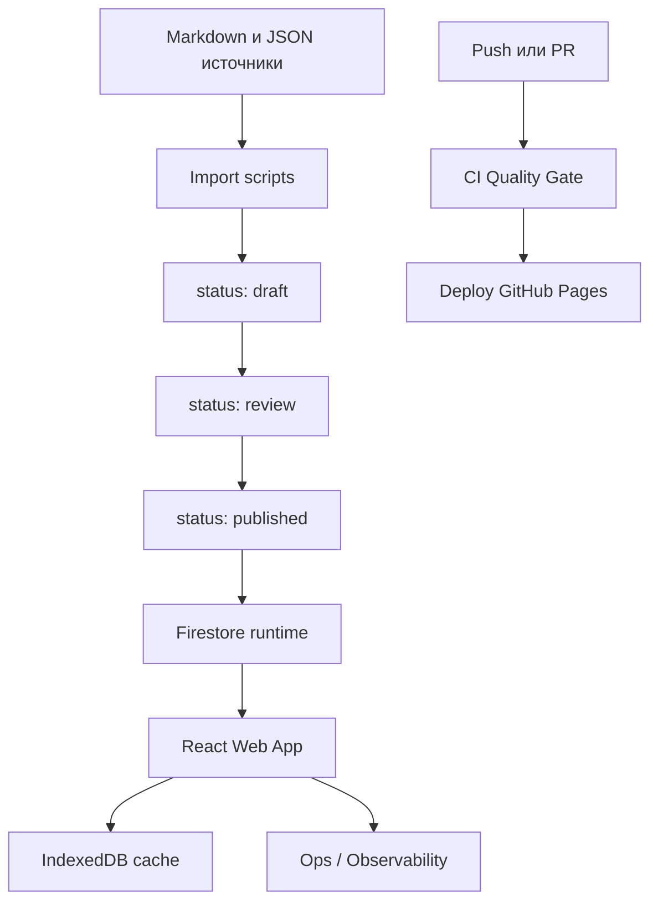

<div align="center">

# E'Magios Core — Companion Site

> Веб-платформа авторской настольной ролевой системы **E'Magios Core**: редактор персонажа, компендиум, броски кубов и контентный конвейер. Дипломный проект — миграция legacy-сайта (vanilla JS) на React + Feature-Sliced Design.

<br>

[](https://kaliguri.github.io/E-Magios-Core-Site/)
[](https://kaliguri.github.io/E-Magios-Core-Site/#/ops)

<br>

[](https://github.com/Kaliguri/E-Magios-Core-Site/actions/workflows/ci.yml)
[](https://github.com/Kaliguri/E-Magios-Core-Site/actions/workflows/deploy.yml)


</div>

---

<details>
<summary><b>Архитектура</b></summary>

<br>



Проект устроен как гибрид трёх контуров:

- **Контентный конвейер** (`scripts/data-pipeline`, `scripts/import-content`) — нормализация и валидация источников, статусный workflow `draft → review → published → archived`, версионирование и аудит публикаций.
- **Backend без сервера** — Firebase Auth + Firestore с ролевой моделью доступа в `firestore.rules`; приложение читает только опубликованные документы.
- **Веб-приложение** (`apps/web`) — React + TypeScript + Vite на архитектуре Feature-Sliced Design, с офлайн-кэшем в IndexedDB и собственным контуром наблюдаемости.

</details>

---

## О проекте

**E'Magios Core** — авторская настольная ролевая система. Этот репозиторий — её цифровой контур: инженерный пайплайн публикации контента и веб-приложение игрока. Проект выполнен как выпускная квалификационная работа и демонстрирует **миграцию устаревшего сайта на vanilla JS к современному стеку React + Feature-Sliced Design** без потери паритета по функциям.

### Что внутри

| Раздел | Описание |
|---|---|
| **Редактор персонажа** | Полнофункциональный лист персонажа с расчётами, экипировкой и навыками |
| **Компендиум** | База данных мира: заклинания, существа, предметы, школы магии — с перекрёстными ссылками |
| **Броски кубов** | Глобальный виджет дайсов с историей бросков и настройками |
| **Контентный workflow** | Статусная модель публикации с аудитом и версионированием |
| **Observability MVP** | Бесплатный контур телеметрии: page views, ошибки UI, метрики загрузок данных, страница `/ops` |
| **Ролевой доступ** | `author / editor / admin` поверх Firestore Security Rules |

### Ключевые инженерные решения

- **Feature-Sliced Design** — строгое разделение слоёв и явные границы между фичами.
- **Контент как данные** — источники в JSON/Markdown проходят через нормализацию, валидацию и статусный конвейер перед попаданием в runtime.
- **Версионирование контента** — `doc.version` растёт только при реальном изменении payload; манифест релиза фиксирует изменённые коллекции и документы.
- **Zero-cost инфраструктура** — GitHub Pages + Firebase free tier + собственная телеметрия без внешних платных сервисов.
- **Quality Gate в CI** — lint, format, typecheck, тесты и сборка как обязательные проверки на каждый PR.

---

<details>
<summary><b>Для разработчиков</b></summary>

<br>

### Технический стек

| | |
|---|---|
| **Frontend** | React 18, TypeScript 5, Vite 5, React Router 6 |
| **Архитектура** | Feature-Sliced Design |
| **Backend** | Firebase Auth + Cloud Firestore |
| **Кэш / офлайн** | IndexedDB (через `idb`) |
| **Контент-пайплайн** | TypeScript (`tsx`) + Python |
| **Качество** | ESLint 9, Prettier 3, Vitest 2, Testing Library |
| **CI/CD** | GitHub Actions + GitHub Pages |

### Структура репозитория

```text
E-Magios-Core-Site/
├── apps/web/                    # React + TypeScript + Vite (Feature-Sliced Design)
├── scripts/import-content/      # импорт в Firestore + workflow + smoke-проверки
├── scripts/data-pipeline/       # normalize / validate / relations / report
├── data/                        # исходный JSON для импорта
├── reports/                     # сгенерированные отчёты валидации и данных
├── docs/                        # план миграции, gap-анализ, UX-аудит
├── dashboard.html               # legacy-дэшборд (метрики качества контента)
├── .github/workflows/           # CI и деплой
├── firestore.rules              # ролевая модель доступа
└── firestore.indexes.json       # индексы Firestore
```

### Локальный запуск

**Веб-приложение:**

```bash
cd apps/web
npm install
npm run dev
```

**Import scripts:**

```bash
cd scripts/import-content
npm install
npm run check
```

**Data processing:**

```bash
python scripts/data-pipeline/process_data.py --no-fail-on-errors
```

**Legacy-превью (статика):**

```bash
python -m http.server 8000
# http://localhost:8000/dashboard.html
# http://localhost:8000/reports/data_report.html
```

> Для импорта в Firestore нужен `scripts/import-content/service-account.json`.

### Quality Gate

`apps/web`:

```bash
npm run lint
npm run format:check
npm run typecheck
npm run test
npm run check    # агрегатор
```

`scripts/import-content`:

```bash
npm run typecheck
npm run smoke
npm run check    # агрегатор
```

`scripts/data-pipeline`:

```bash
python scripts/data-pipeline/process_data.py
python scripts/data-pipeline/process_data.py --include-normalize
python scripts/data-pipeline/process_data.py --strict
```

### CI/CD

| Workflow | Триггер | Назначение |
|---|---|---|
| `.github/workflows/ci.yml` | `pull_request`, `push` в `main/dev` | Установка зависимостей, `check` + `build` для `apps/web` и `import-content`, генерация отчётов data-pipeline, проверка артефактов |
| `.github/workflows/deploy.yml` | `push` в `main` | Сборка `apps/web` → публикация `dist-react` в GitHub Pages |

### Контентный workflow

Поддерживаемые статусы: `draft`, `review`, `published`, `archived`. Переходы выполняются через `scripts/import-content/content-workflow.ts`, аудит пишется в `content_publication_log`.

```bash
cd scripts/import-content
npm run workflow:submit-review
npm run workflow:publish
npm run workflow:archive
```

Кастомный переход:

```bash
npx tsx content-workflow.ts --from=draft --to=review --role=author \
  --actorId=<id> --collection=spells --changeSummary="Batch update"
```

По умолчанию импорт выставляет `status=draft`, можно переопределить:

```bash
IMPORT_STATUS=published npm run import:compendium
```

### Версионирование контента

- `doc.version` увеличивается только при реальном изменении payload;
- неизменённые документы сохраняют прежнюю версию;
- манифест `contentManifest/production` обновляет `collections.<name>.version`, `contentRevision`, `release.version`, `release.tag`, `release.changedCollections`, `release.changedDocs`.

### Observability MVP

Бесплатный контур наблюдаемости:

- `ErrorBoundary` фиксирует UI-сбои в `client_telemetry`;
- роутинг пишет `page_view`;
- загрузки данных пишут `cache_hit`, `data_fetch_success`, `data_fetch_error`;
- страница `/ops` показывает последние события телеметрии, публикационные логи и агрегированную сводку.

### Безопасность и роли

`firestore.rules` поддерживают роли `author`, `editor`, `admin`. Для контентных коллекций:

- публичное чтение только при `status == "published"`;
- create/update ограничены ролью и допустимыми переходами статусов;
- `content_publication_log` и `client_telemetry` читаются только `editor/admin`;
- `client_telemetry` допускает `create` только для авторизованных пользователей.

### Roadmap

1. Отдельный admin-UI для ручного управления переходами статусов.
2. Вынос части контентного workflow в server-side функции.
3. Тесты для `content-workflow.ts` и versioning-логики import scripts.
4. Расширение Ops-дэшборда до метрик периодов (DAU/WAU/MAU, publish lead time).

</details>

---

## Лицензия

**© 2026 Гайдарь М.Д. (Max Gaida). Все права защищены.**

Репозиторий опубликован в открытом доступе исключительно для демонстрации в портфолио и code review.
Использование, копирование, распространение или создание производных работ **без письменного разрешения автора запрещено**.

Подробнее — [`LICENSE.md`](LICENSE.md).

---

## Референсы

Для архитектурных паттернов и оформления использовались:

- [Posleslovie](https://github.com/Kaliguri/Posleslovie)
- [Guildmaster-Autobattler](https://github.com/Kaliguri/Guildmaster-Autobattler)
