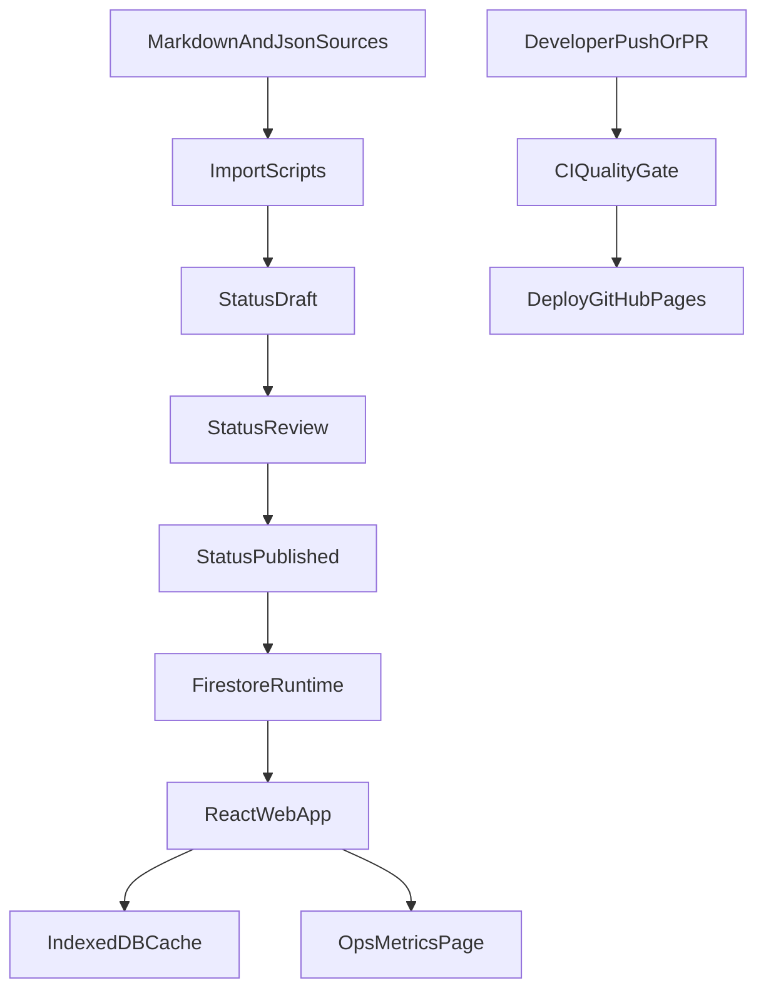

# E'Magios Core Site

Официальный сайт и инженерный контур проекта E'Magios Core.

Live: [https://kaliguri.github.io/E-Magios-Core-Site/](https://kaliguri.github.io/E-Magios-Core-Site/)

## Текущее состояние и целевая архитектура

Проект развивается как гибрид:

- legacy-контент в корне репозитория (статические книги);
- SPA на React в `apps/web`;
- контентный контур импорта в `scripts/import-content`;
- backend через Firebase Auth + Firestore;
- публикация через GitHub Pages.



## Репозиторная структура

```text
E-Magios-Core-Site/
├── apps/web/                    # React + TypeScript + Vite
├── scripts/import-content/      # import + workflow + smoke checks
├── scripts/data-pipeline/       # normalize/validate/relations/report
├── data/                        # source JSON for import scripts
├── reports/                     # generated validation/data reports
├── dashboard.html               # legacy dashboard page
├── dashboard.js                 # legacy dashboard logic
├── .github/workflows/           # CI and deploy workflows
├── firestore.rules              # access model and roles
├── firestore.indexes.json       # firestore indexes
└── README.md
```

## Quality Gate

`apps/web`:

- `npm run lint`
- `npm run format:check`
- `npm run typecheck`
- `npm run test`
- `npm run check` (агрегатор)

`scripts/import-content`:

- `npm run typecheck`
- `npm run smoke`
- `npm run check` (агрегатор)

`scripts/data-pipeline`:

- `python scripts/data-pipeline/process_data.py`
- `python scripts/data-pipeline/process_data.py --include-normalize`
- `python scripts/data-pipeline/process_data.py --strict`

## CI/CD

### CI (`.github/workflows/ci.yml`)

На `pull_request` и `push` в `main/dev`:

1. Установка зависимостей `apps/web` и `scripts/import-content`.
2. `apps/web`: `npm run check`, `npm run build`.
3. `scripts/import-content`: `npm run check`.
4. `scripts/data-pipeline`: генерация `reports/validation_report.json` и `reports/data_report.json`.
5. Проверка существования report-артефактов.

### CD (`.github/workflows/deploy.yml`)

На `push` в `main`:

1. Build `apps/web`.
2. Публикация `dist-react` в GitHub Pages.

## Контентный workflow

Поддерживаемые статусы:

- `draft`
- `review`
- `published`
- `archived`

Переходы выполняются через `scripts/import-content/content-workflow.ts`.

Готовые команды:

```bash
cd scripts/import-content
npm run workflow:submit-review
npm run workflow:publish
npm run workflow:archive
```

Кастомный запуск:

```bash
npx tsx content-workflow.ts --from=draft --to=review --role=author --actorId=<id> --collection=spells --changeSummary="Batch update"
```

Аудит переходов пишется в `content_publication_log`.

## Версионирование контента

Версионирование реализовано в import-скриптах:

- `doc.version` увеличивается только при реальном изменении payload;
- неизмененные документы сохраняют прежнюю версию;
- манифест `contentManifest/production` обновляет:
  - `collections.<name>.version`
  - `contentRevision`
  - `release.version`
  - `release.tag`
  - `release.changedCollections`
  - `release.changedDocs`

По умолчанию импорт выставляет `status=draft`. Можно переопределить:

```bash
IMPORT_STATUS=published npm run import:compendium
```

## Legacy data-processing и dashboard

Data-processing pipeline:

```bash
python scripts/data-pipeline/process_data.py
```

Pipeline создает:

- `reports/validation_report.json`
- `reports/data_report.json`
- `reports/data_report.html`

Схема отчета зафиксирована в `scripts/data-pipeline/report_schema.md` (`schemaVersion: 1.0.0`).

Legacy dashboard:

- страница: `dashboard.html`
- источник метрик качества/контента: `reports/data_report.json`
- источник метрик бросков:
  - при наличии localStorage событий: `diceRollEventsLegacy`
  - иначе fallback на блок `dice` в `reports/data_report.json`

Формат локального dice-события:

```json
{
  "eventId": "uuid",
  "userId": "uid_or_anonymous",
  "characterId": "optional",
  "diceType": "d12",
  "sides": 12,
  "result": 9,
  "modifier": 0,
  "total": 11,
  "context": "arcana|hit|apply|other",
  "sessionId": "session-id",
  "createdAt": 1717330000000,
  "appVersion": "legacy-site"
}
```

## Observability MVP

Бесплатный контур наблюдаемости:

- `ErrorBoundary` фиксирует UI-сбои в `client_telemetry`;
- роутинг пишет `page_view` telemetry;
- загрузки данных пишут `cache_hit`, `data_fetch_success`, `data_fetch_error`;
- служебная страница `/ops` показывает:
  - последние telemetry события;
  - последние публикационные логи;
  - агрегированную сводку по типам telemetry событий.

## Безопасность и роли

`firestore.rules` поддерживают роли:

- `author`
- `editor`
- `admin`

Для контентных коллекций:

- публичное чтение только `status == "published"`;
- create/update ограничены ролью и допустимыми переходами статусов;
- `content_publication_log` и `client_telemetry` читаются только `editor/admin`;
- `client_telemetry` допускает `create` только для авторизованных пользователей.

## Локальный запуск

Web:

```bash
cd apps/web
npm install
npm run dev
```

Import scripts:

```bash
cd scripts/import-content
npm install
npm run check
```

Data processing:

```bash
python scripts/data-pipeline/process_data.py --no-fail-on-errors
```

Legacy static preview:

```bash
python -m http.server 8000
```

Открыть:

- `http://localhost:8000/dashboard.html`
- `http://localhost:8000/reports/data_report.html`

Для импорта в Firestore нужен `scripts/import-content/service-account.json`.

## Roadmap (следующий этап)

1. Добавить отдельный admin UI для ручного управления переходами статусов.
2. Вынести часть контентного workflow в server-side функции.
3. Добавить тесты для `content-workflow.ts` и versioning-логики import scripts.
4. Расширить Ops-дэшборд до метрик периодов (DAU/WAU/MAU и publish lead time).

## Референсы

Для архитектурных паттернов и организационных решений использовались:

- [Posleslovie](https://github.com/Kaliguri/Posleslovie)
- [Guildmaster-Autobattler](https://github.com/Kaliguri/Guildmaster-Autobattler)
