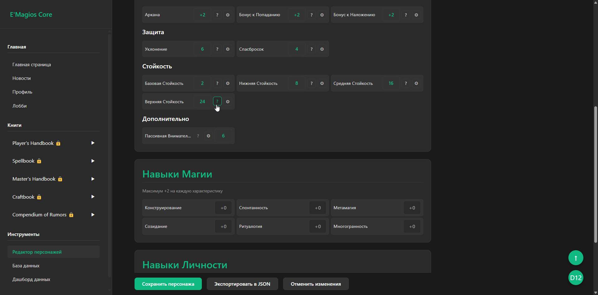
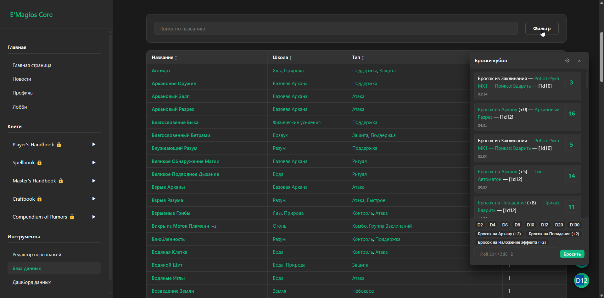
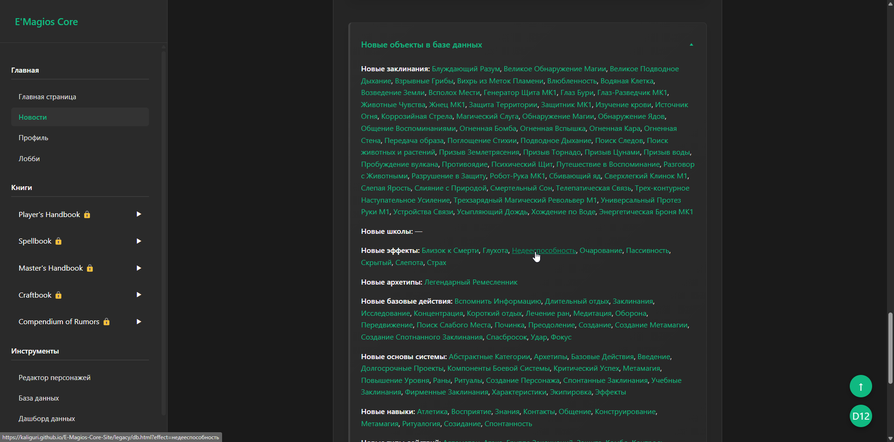
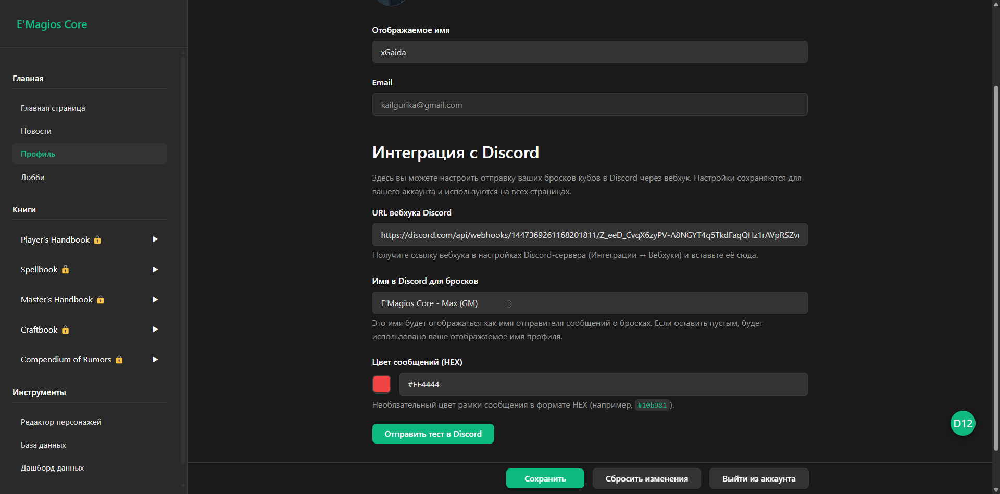
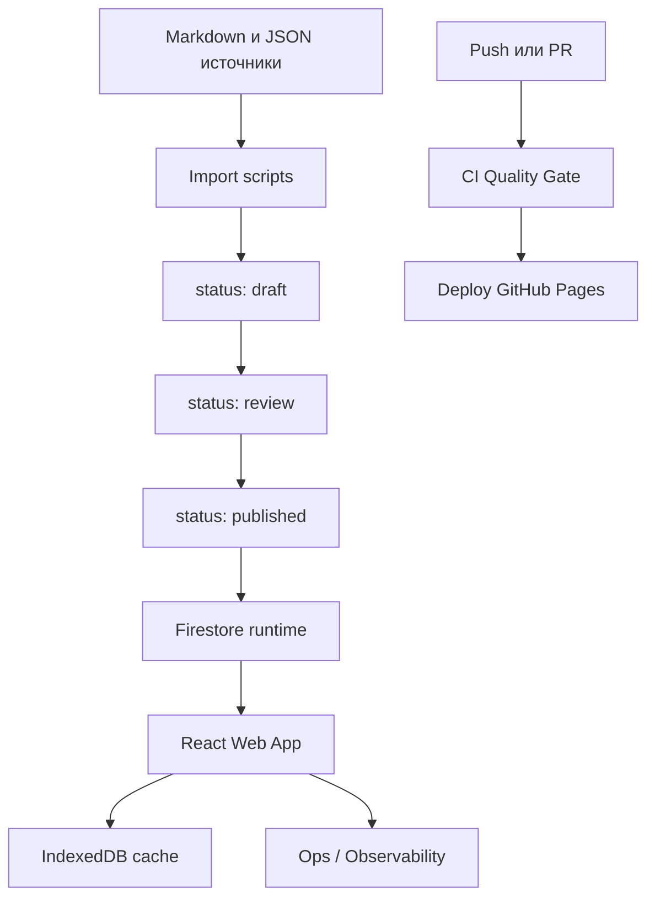

<!-- ============================================================
     README.md — один файл, только русский.
     Левое выравнивание. Без упоминаний AI.
     ============================================================ -->

<a id="top"></a>

# E'Magios Core — Companion Site

> Веб-приложение авторской настольной ролевой системы **E'Magios Core**: редактор персонажа, компендиум мира и глобальный виджет бросков кубов. Дипломный проект на React + Feature-Sliced Design.

<p>
  <a href="https://github.com/Kaliguri/E-Magios-Core-Site/actions"></a>
  <a href="https://kaliguri.github.io/E-Magios-Core-Site/"></a>
  
</p>

|                      |                                                                                                                                                                                                                                                                                                                                                                                                                                                                                                                                                |
| -------------------- | ---------------------------------------------------------------------------------------------------------------------------------------------------------------------------------------------------------------------------------------------------------------------------------------------------------------------------------------------------------------------------------------------------------------------------------------------------------------------------------------------------------------------------------------------- |
| **Frontend**         | <a href="https://reactjs.org/"></a> <a href="https://www.typescriptlang.org/"></a> <a href="https://vitejs.dev/"></a> <a href="https://reactrouter.com/"></a>   |
| **Архитектура**      |                                                                                                                                                                                                           |
| **Backend**          | <a href="https://firebase.google.com/docs/auth"></a> <a href="https://firebase.google.com/docs/firestore"></a> <a href="https://github.com/jakearchibald/idb"></a>                                                         |
| **Контент-пайплайн** | <a href="https://github.com/privatenumber/tsx"></a> <a href="https://www.python.org/"></a>                                                                                                                                                                                                                                                                               |
| **Инструменты**      | <a href="https://eslint.org/"></a> <a href="https://prettier.io/"></a> <a href="https://vitest.dev/"></a> <a href="https://github.com/features/actions"></a> |

<p>
  <a href="https://kaliguri.github.io/E-Magios-Core-Site/"><b>▶ Открыть сайт</b></a>
</p>

---

<details>
<summary><b>Скриншоты</b></summary>

<details>
<summary>Редактор персонажа</summary>



</details>

<details>
<summary>Компендиум и виджет бросков</summary>



</details>

<details>
<summary>Новости</summary>



</details>

<details>
<summary>Профиль и интеграция с Discord</summary>



</details>

</details>

---

## О проекте

**E'Magios Core** — авторская настольная ролевая система. Этот репозиторий — её цифровой контур: веб-приложение игрока на React + Feature-Sliced Design и инженерный конвейер публикации контента. Выполнен как выпускная квалификационная работа.

> **Что демонстрирует проект:** Feature-Sliced Design в боевом масштабе, конвейер «контент как данные» с аудитом и версионированием, ролевую модель доступа поверх Firestore, офлайн-кэш в IndexedDB и zero-cost деплой под защитой CI quality gate.

### Ключевые возможности

| Возможность             | Описание                                                                                 |
| ----------------------- | ---------------------------------------------------------------------------------------- |
| **Редактор персонажа**  | Полнофункциональный лист персонажа с расчётами, экипировкой и навыками                   |
| **Компендиум**          | База данных мира: заклинания, существа, предметы, школы магии — с перекрёстными ссылками |
| **Броски кубов**        | Глобальный виджет дайсов с историей бросков и настройками                                |
| **Контентный workflow** | Статусная модель публикации с аудитом и версионированием                                 |
| **Observability MVP**   | Бесплатный контур телеметрии: page views, ошибки UI, метрики загрузок, страница `/ops`   |
| **Ролевой доступ**      | `author / editor / admin` поверх Firestore Security Rules                                |

---

<details id="for-developers">
<summary><b>Для разработчиков</b></summary>

<br>

### Архитектура



Проект устроен как гибрид трёх контуров:

- **Контентный конвейер** (`scripts/data-pipeline`, `scripts/import-content`) — нормализация и валидация источников, статусный workflow `draft → review → published → archived`, версионирование и аудит публикаций.
- **Backend без сервера** — Firebase Auth + Firestore с ролевой моделью доступа в `firestore.rules`; приложение читает только опубликованные документы.
- **Веб-приложение** (`apps/web`) — React + TypeScript + Vite на архитектуре Feature-Sliced Design, с офлайн-кэшем в IndexedDB и собственным контуром наблюдаемости.

### Технический стек

|                      |                                                 |
| -------------------- | ----------------------------------------------- |
| **Frontend**         | React 18, TypeScript 5, Vite 5, React Router 6  |
| **Архитектура**      | Feature-Sliced Design                           |
| **Backend**          | Firebase Auth + Cloud Firestore                 |
| **Кэш / офлайн**     | IndexedDB (через `idb`)                         |
| **Контент-пайплайн** | TypeScript (`tsx`) + Python                     |
| **Качество**         | ESLint 9, Prettier 3, Vitest 2, Testing Library |
| **CI/CD**            | GitHub Actions + GitHub Pages                   |

### Структура репозитория

```text
E-Magios-Core-Site/
├── apps/web/                    # React + TypeScript + Vite (Feature-Sliced Design)
├── scripts/import-content/      # импорт в Firestore + workflow + smoke-проверки
├── scripts/data-pipeline/       # normalize / validate / relations / report
├── data/                        # исходный JSON для импорта
├── reports/                     # сгенерированные отчёты валидации и данных
├── docs/                        # проектная документация и UX-аудит
├── .github/workflows/           # CI и деплой
├── firestore.rules              # ролевая модель доступа
└── firestore.indexes.json       # индексы Firestore
```

### Локальный запуск

**Веб-приложение:**

```bash
cd apps/web
npm install
npm run dev
```

**Import scripts:**

```bash
cd scripts/import-content
npm install
npm run check
```

**Data processing:**

```bash
python scripts/data-pipeline/process_data.py --no-fail-on-errors
```

> Для импорта в Firestore нужен `scripts/import-content/service-account.json`.

### Quality Gate

`apps/web`:

```bash
npm run lint
npm run format:check
npm run typecheck
npm run test
npm run check    # агрегатор
```

`scripts/import-content`:

```bash
npm run typecheck
npm run smoke
npm run check    # агрегатор
```

### CI/CD

| Workflow                       | Триггер                             | Назначение                                                                                                                        |
| ------------------------------ | ----------------------------------- | --------------------------------------------------------------------------------------------------------------------------------- |
| `.github/workflows/ci.yml`     | `pull_request`, `push` в `main/dev` | Установка зависимостей, `check` + `build` для `apps/web` и `import-content`, генерация отчётов data-pipeline, проверка артефактов |
| `.github/workflows/deploy.yml` | `push` в `main`                     | Сборка `apps/web` → публикация `dist-react` в GitHub Pages                                                                        |

### Контентный workflow

Поддерживаемые статусы: `draft`, `review`, `published`, `archived`. Переходы выполняются через `scripts/import-content/content-workflow.ts`, аудит пишется в `content_publication_log`.

```bash
cd scripts/import-content
npm run workflow:submit-review
npm run workflow:publish
npm run workflow:archive
```

### Версионирование контента

- `doc.version` увеличивается только при реальном изменении payload;
- неизменённые документы сохраняют прежнюю версию;
- манифест `contentManifest/production` обновляет `collections.<name>.version`, `contentRevision`, `release.version`, `release.tag`, `release.changedCollections`, `release.changedDocs`.

### Observability MVP

Бесплатный контур наблюдаемости:

- `ErrorBoundary` фиксирует UI-сбои в `client_telemetry`;
- роутинг пишет `page_view`;
- загрузки данных пишут `cache_hit`, `data_fetch_success`, `data_fetch_error`;
- страница `/ops` показывает последние события телеметрии, публикационные логи и агрегированную сводку.

### Безопасность и роли

`firestore.rules` поддерживают роли `author`, `editor`, `admin`. Для контентных коллекций:

- публичное чтение только при `status == "published"`;
- create/update ограничены ролью и допустимыми переходами статусов;
- `content_publication_log` и `client_telemetry` читаются только `editor/admin`;
- `client_telemetry` допускает `create` только для авторизованных пользователей.

</details>

---

## License

© 2026 Гайдарь М.Д. (Max Gaida). All rights reserved.

This repository is public for portfolio and demonstration purposes only.
No license is granted to use, copy, modify, or distribute any part of it
without prior written permission from the author.

See [LICENSE.md](LICENSE.md) for details.
