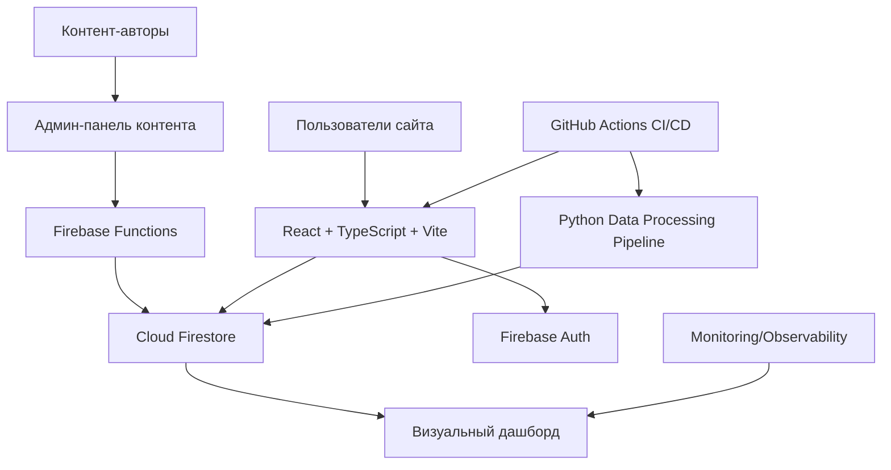
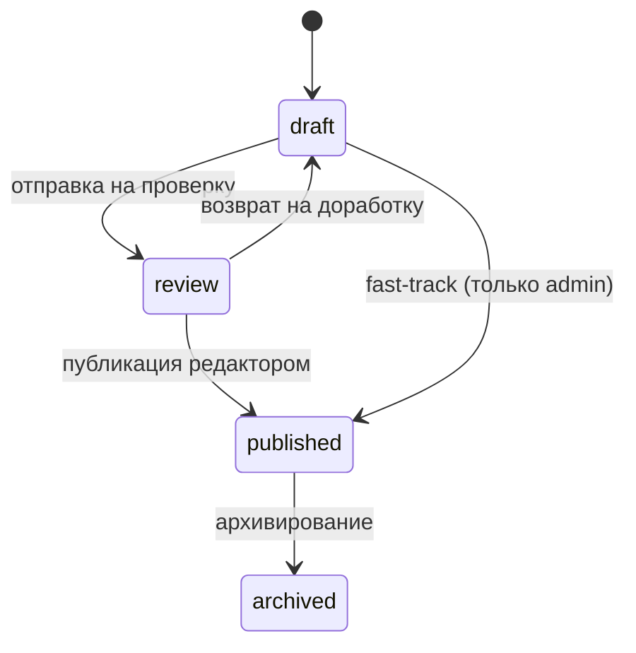

# План архитектуры для написания пояснительной записки

## Назначение документа

Документ задает целевую архитектуру и структуру изложения для пояснительной записки дипломного проекта E'Magios Core так, как будто все запланированные улучшения уже реализованы в полном объеме.

Документ ориентирован на стек:
- React 18
- TypeScript
- Vite
- Firebase Authentication
- Cloud Firestore
- Firebase Functions (контентный workflow и агрегации)
- Python (обработка данных: нормализация, валидация, связи, отчеты)
- GitHub Actions (CI/CD)

## 1. Паспорт архитектурного решения (для раздела "Краткая характеристика системы")

Система реализована как веб-платформа для работы со справочным контентом настольной ролевой системы, пользовательскими данными и аналитикой бросков кубов. Архитектура построена по модульному принципу с разделением представления, доменной логики, доступа к данным и процессов публикации контента.

Ключевые свойства решения:
- единый runtime-источник данных: Firestore;
- управляемый жизненный цикл контента: `draft -> review -> publish`;
- автоматизированная проверка качества кода и данных;
- наблюдаемость ошибок, производительности и контентных метрик;
- встроенный визуальный дашборд по данным и броскам кубов.

## 2. Готовая формулировка цели и задач диплома

## Цель

Разработать и внедрить архитектуру веб-платформы E'Magios Core на стеке React + TypeScript + Vite + Firebase, обеспечивающую надежное управление контентом, контроль качества данных, аналитику пользовательской активности и воспроизводимый процесс поставки.

## Задачи

1. Реализовать модульную архитектуру клиентского приложения.
2. Реализовать защищенную модель хранения данных и доступа в Firestore.
3. Реализовать контур обработки данных (нормализация, валидация, проверка связей, отчетность).
4. Реализовать редакционный workflow публикации контента.
5. Реализовать визуальный дашборд качества данных и метрик бросков кубов.
6. Внедрить CI/CD и quality gate.
7. Обеспечить наблюдаемость и контроль эксплуатационных показателей.

## 3. Архитектурная модель (для основной технической главы)

## 3.1 Контекстная схема системы

## 3.2 Логические слои

1. Presentation Layer:
   - страницы, виджеты, UI-компоненты, маршрутизация.
2. Application Layer:
   - use-case логика, hooks, сценарии пользователя.
3. Domain Layer:
   - типы сущностей, DTO, мапперы, схемы данных, бизнес-правила.
4. Data Access Layer:
   - репозитории Firestore и адаптеры доступа.
5. Content Workflow Layer:
   - процессы создания, ревью, публикации и архивирования.
6. Data Processing Layer:
   - нормализация, валидация, проверка связей, отчетность.
7. Analytics Layer:
   - агрегаты метрик и визуальный дашборд.
8. Delivery & Operations Layer:
   - CI/CD, quality gate, мониторинг и алертинг.

## 3.3 Физическая структура решения

- `apps/web` — фронтенд-приложение.
- `scripts/import-content` — контур загрузки и публикации контента.
- `scripts/data-processing` — нормализация, валидация и отчеты.
- `reports/` — результаты обработки данных.
- `.github/workflows` — CI/CD пайплайны.
- `firestore.rules` и `firestore.indexes.json` — безопасность и индексация.

## 4. Модель данных и управление контентом

## 4.1 Модель контента

Каждая сущность контента хранит:
- `id`, `name`;
- `status: draft | review | published | archived`;
- `version`, `schemaVersion`;
- `authorId`, `reviewerId`;
- `createdAt`, `updatedAt`, `publishedAt`;
- `references[]` (ссылки на другие сущности).

## 4.2 Коллекции Firestore

Основные:
- `spells`, `schools`, `effects`, `actions`, `skills`, `archetypes`, `recipes`, и другие справочники.
- `contentManifest/production`.
- `content_publication_log`.
- `users/{uid}` и `users/{uid}/characters/{id}`.
- `dice_roll_events`.
- агрегаты: `dice_roll_agg_daily`, `dice_roll_agg_user_daily`, `data_quality_agg_by_version`.

## 4.3 Процесс публикации контента

## 5. Контур обработки данных (ключевой инженерный раздел)

## 5.1 Этапы обработки

1. Нормализация (приведение к единому формату).
2. Валидация структуры и значений.
3. Проверка ссылочной целостности.
4. Формирование статистического отчета.
5. Публикация агрегатов для дашборда.

## 5.2 Модули обработки

- `normalize_data.py`
- `validate_data.py`
- `check_relations.py`
- `generate_data_report.py`
- `process_data.py` (оркестратор)

## 5.3 Типы выявляемых проблем

- дубликаты `id`;
- пустые обязательные поля;
- некорректные enum-значения;
- несовпадение форматов массивов и полей;
- битые межобъектные ссылки;
- несоответствие схеме DTO.

## 5.4 Результаты обработки

- `validation_report.json`;
- `data_report.json`;
- `data_report.html`;
- агрегированные таблицы для dashboard.

## 6. Визуальный дашборд и аналитика бросков кубов

## 6.1 Разделы дашборда

1. Data Quality:
   - ошибки и предупреждения по коллекциям;
   - динамика качества по релизам;
   - список битых ссылок.

2. Content Metrics:
   - распределение заклинаний по школам;
   - полнота данных;
   - плотность межобъектных связей.

3. Dice Analytics:
   - количество бросков по типам кубов (`d4/d6/d8/d10/d12/d20/d100`);
   - средние значения по типам;
   - медиана, перцентили и дисперсия;
   - сравнение пользовательских и глобальных метрик;
   - частота критических значений.

## 6.2 Событийная модель броска

Для каждого броска фиксируются:
- пользователь;
- тип куба и количество граней;
- результат и итог с модификатором;
- контекст броска;
- серверное время события.

## 6.3 Практическая ценность

Визуальный дашборд используется как:
- инструмент контроля качества данных;
- инструмент продуктовой аналитики;
- демонстрационный модуль для защиты диплома.

## 7. Безопасность и разграничение доступа

## 7.1 Аутентификация и роли

- аутентификация через Firebase Auth;
- роли: `author`, `editor`, `admin`, `user`;
- роли назначаются через claims и проверяются серверной логикой.

## 7.2 Политика доступа Firestore

- публичное чтение только опубликованных сущностей;
- запись контента только через административные сценарии;
- пользователь работает только со своими профилем и персонажами;
- доступ к служебным логам ограничен.

## 7.3 Безопасность публикации

- обязательная серверная валидация перед `publish`;
- аудит действий редакторов;
- откат публикации на предыдущую ревизию.

## 8. CI/CD и quality gate

## 8.1 CI pipeline

При каждом `push/PR`:
- `lint`;
- `format:check`;
- `typecheck`;
- `test`;
- `build`;
- проверка data-processing pipeline.

## 8.2 CD pipeline

После успешного CI на `main`:
- сборка production-версии;
- публикация статического сайта;
- обновление артефактов отчетов и метрик.

## 8.3 Критерии качества релиза

- нет критических ошибок линтера и типизации;
- тесты проходят;
- валидация данных не содержит блокирующих ошибок;
- production-сборка успешна.

## 9. Наблюдаемость и эксплуатационные метрики

## 9.1 Что мониторится

- фронтенд-ошибки;
- время загрузки страниц и коллекций;
- процент cache hit;
- число публикаций и время прохождения workflow;
- динамика ошибок валидации.

## 9.2 Почему это важно

Наблюдаемость позволяет количественно подтверждать надежность решения и улучшать систему на основе фактических данных.

## 10. Результаты, которые нужно зафиксировать в пояснительной записке

## 10.1 Технические результаты

1. Внедрена модульная архитектура веб-приложения.
2. Реализован управляемый жизненный цикл контента.
3. Внедрен контур обработки и валидации данных.
4. Реализован визуальный дашборд данных и бросков кубов.
5. Внедрен CI/CD и quality gate.
6. Обеспечены безопасность и наблюдаемость.

## 10.2 Практические результаты

1. Снижено количество ошибок контента до публикации.
2. Повышена воспроизводимость релизов.
3. Ускорена диагностика проблем через мониторинг.
4. Получена аналитика пользовательской активности по броскам кубов.

## 11. Готовый шаблон структуры пояснительной записки

1. Введение.
2. Анализ предметной области и требований.
3. Выбор технологий и обоснование стека.
4. Проектирование архитектуры системы.
5. Проектирование модели данных и контентного workflow.
6. Реализация обработки данных и валидации.
7. Реализация визуального дашборда и аналитики бросков.
8. Обеспечение качества: тестирование, CI/CD, quality gate.
9. Обеспечение безопасности и наблюдаемости.
10. Экономическая/практическая эффективность (по требованиям вуза).
11. Заключение.

## 12. Формулировки для раздела "Заключение"

В ходе выполнения проекта разработана и внедрена архитектура веб-платформы на стеке React, TypeScript, Vite и Firebase, обеспечивающая управляемую публикацию контента, автоматизированную обработку и валидацию данных, а также визуальную аналитику качества данных и пользовательских бросков кубов.

Реализованный инженерный контур CI/CD, quality gate и observability повысил надежность поставки, упростил сопровождение системы и обеспечил возможность принятия решений на основе измеримых метрик.

## 13. Что подготовить как приложения к дипломной работе

1. Скриншоты дашборда (все разделы).
2. Пример `validation_report.json`.
3. Пример `data_report.json`.
4. Выдержки из `firestore.rules`.
5. Выдержки из CI/CD workflow.
6. Таблица метрик до/после внедрения.

